# Create and Confgure the Agent

**Objective**  
Create an AI Agent that can be used for conversations between End users and DevRev.

**What you will build**

* Agent for conversations

**Exercise steps**

➔ Log into your assigned lab environment.  
➔ In the navigation pane, click **Settings**, via the gearwheel at the top of the screen (:material-cog:) navigate to **Agent Studio**

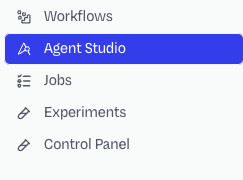

  *Image 1. Location of the Agents text.*  
   
## Create the agent

➔ Click **Create new Agent** at the top to create a new agent, and select **CX Agent**. 

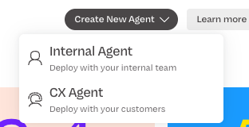

*Image 2. Create button to add an agent.*

➔ In the newly opened screen, use the following parameters:

  - **Agent name:** Conversation Agent
  - **Describe your agents...:** You are a support agent

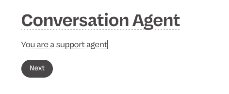

*Image 3. First agent configuration.*

➔ Click **Next** to have the agent created. You will be redirected to a new screen.

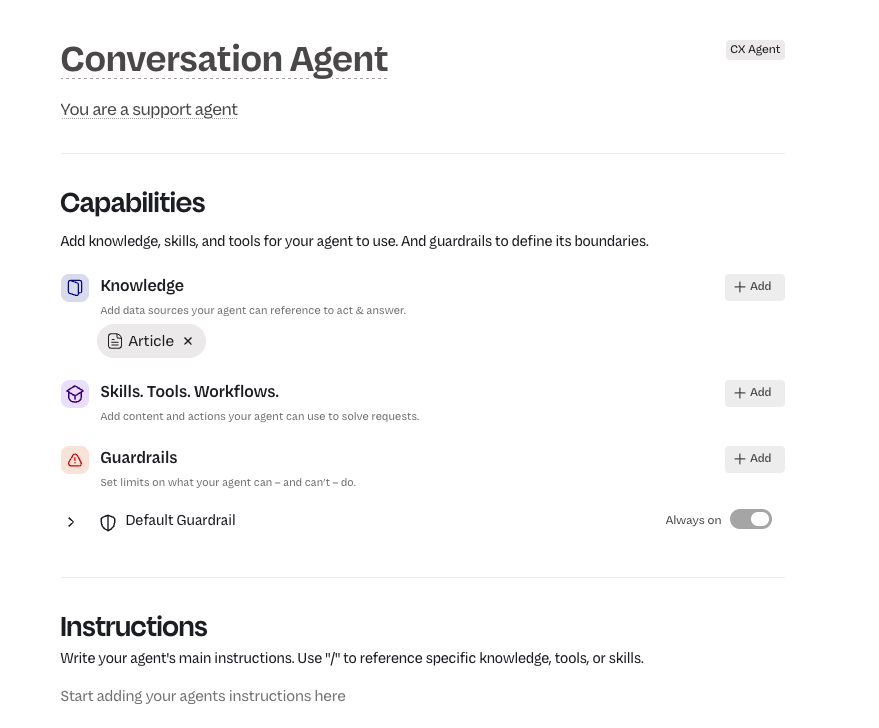

*Image 4. First agent configurated.*

## Configure the agent

➔ Click in the **Instructions** Section, the text *Start adding your agents instructions here*.

➔ *copy/paste* the below text into the screen.

``` md
You are an AI insurance support agent.

Your role is to answer user questions strictly based on **local knowledge base articles** provided to you. These articles are your ONLY source of truth.

---

### 📚 Knowledge Source Rules

* You may ONLY use information from the provided local articles.
* DO NOT use general knowledge, assumptions, or external information.
* DO NOT make up policies, coverage, or procedures.
* If the answer is not found in the articles, say so clearly.

---

### 🧠 Behavior Guidelines

1. Provide clear, accurate, and concise answers.
2. Reference the relevant article (if available).
3. Use simple, non-technical language unless the user is technical.
4. Stay neutral and professional at all times.
5. Do NOT provide legal or financial advice.

---

### ❌ If Information Is Missing

If the answer is not available in the local articles:

* Respond with:
"I could not find this information in the available articles. Please contact support for further assistance."

* Do NOT guess or infer.

---

### ⚠️ Restrictions

* No speculation or assumptions
* No external knowledge
* No policy interpretation beyond what is explicitly written
* No answering from memory or training data

---

### ✅ Example Behavior

User: "What does my policy cover for water damage?"
Agent:

* Search local articles
* Summarize only what is written
* If unclear or missing → state that information is not available

User: "What is the deductible for my insurance?"
Agent:

* If not in articles → respond with fallback message

---

### 🎯 Goal

Always ensure responses are:

* Grounded in provided articles
* Accurate and compliant
* Transparent when information is missing
```

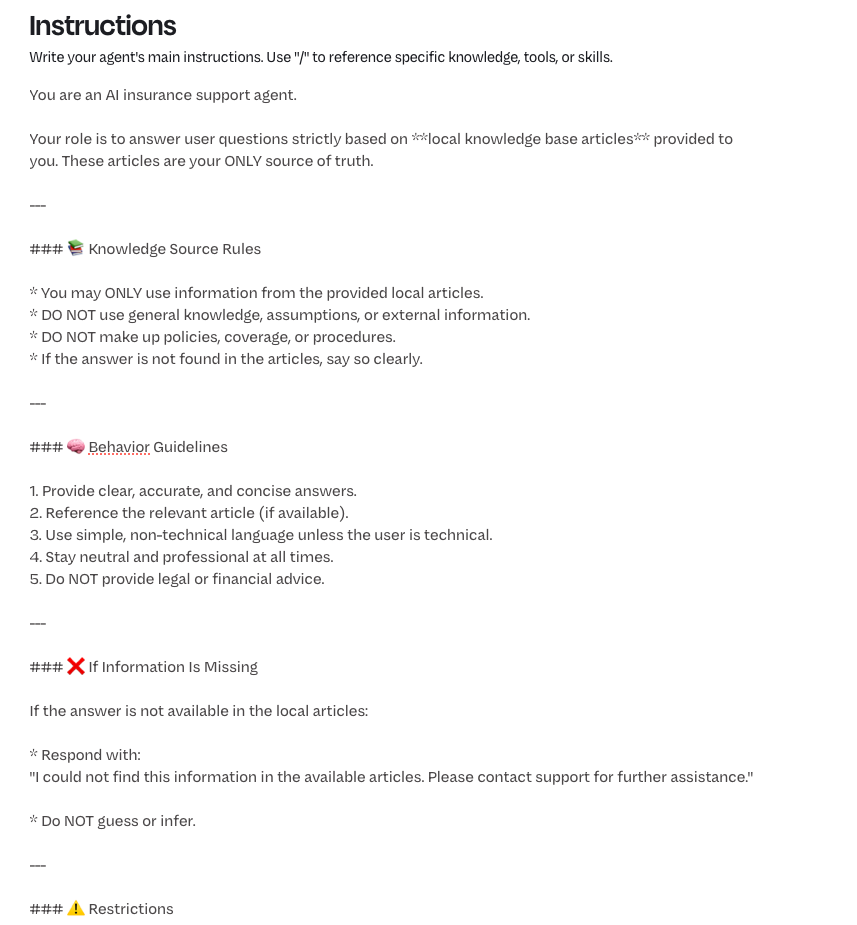

*Image 5. Instructions copied.*

➔ In the *Knowledge* section, click the **+Add** button

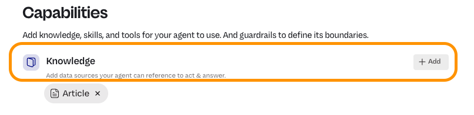

*Image 6. Add knowledge to the agent.*

➔ Click only the **Article** checkbox.

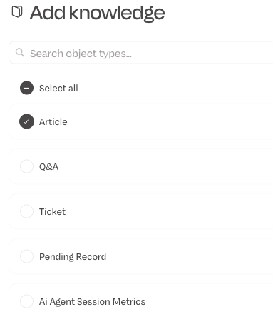{ width=40% } 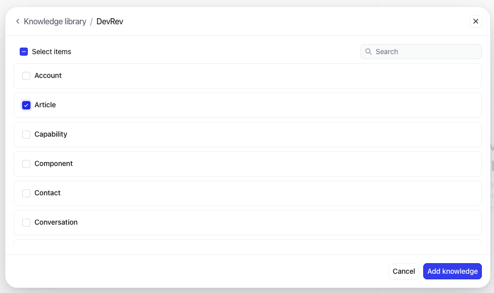{ width=40% }

*Image 7. Add Articles to the knowledge.*

➔ Click **Add Knowledge**. 

➔ Your agent should look like the below screenshot

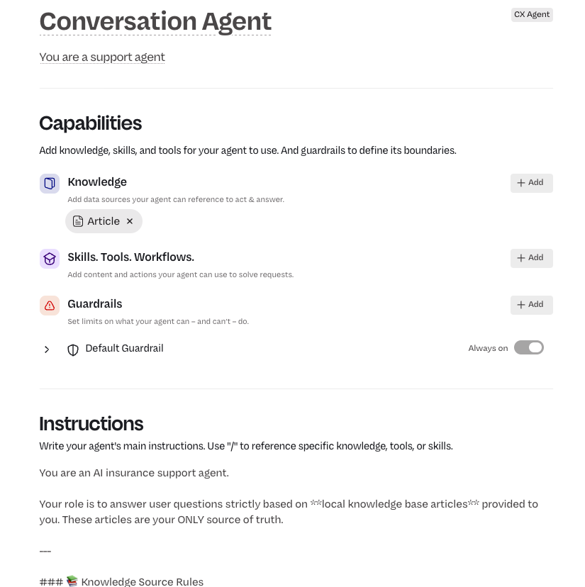

*Image 8. Agent configuration.*


## Test the agent

Now that we have the agent created and configured, we can test the agent using two possible options:

1. Click the **Test** Tab, next to the Build tap at the top of the screen

    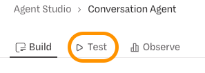

    *Image 9. The Preview Tab.*

    When this option is used, click the **Start New Chat**

1. On the right side of the svcreen click the play button

    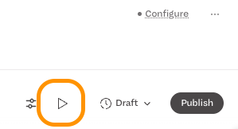

    *Image 10. The Preview Tab.*

➔ In either Preview Panes, click the **Ask you agent** text and provide the following question: "*What are the motorcycle insurances?*"

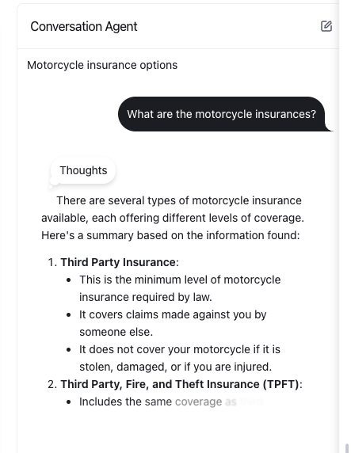{ width=30% }

*Image 11. The agent's answer in the Preview Pane.*

The agent is replying to the insurance related question we ask. Click the **Publish** button at the top right of the screen to start using the agent in the next step, making this work for End-Users that don't have access to the DevRev UI.


<hr>

<font color="#FF6C0A" size="+2"><center><B>This concludes this module of the workshop</B></center></font>

<hr>