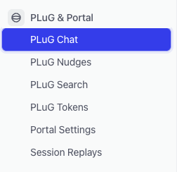
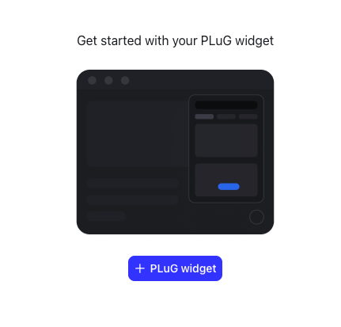
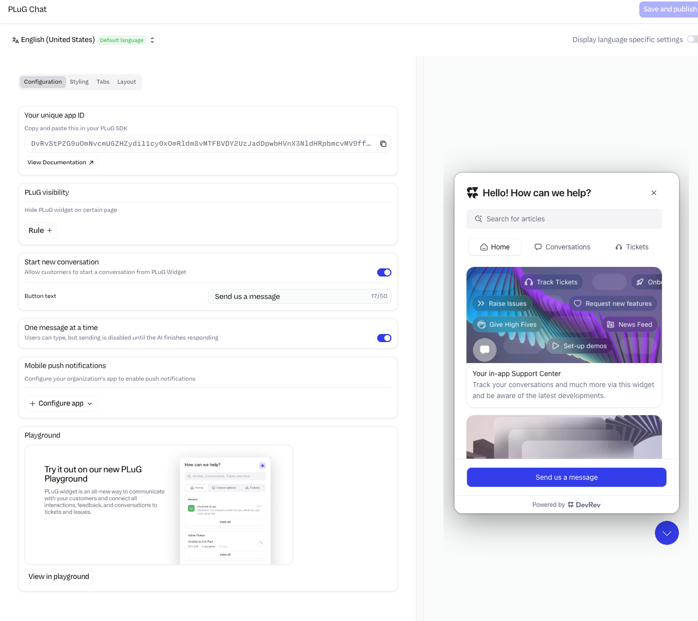
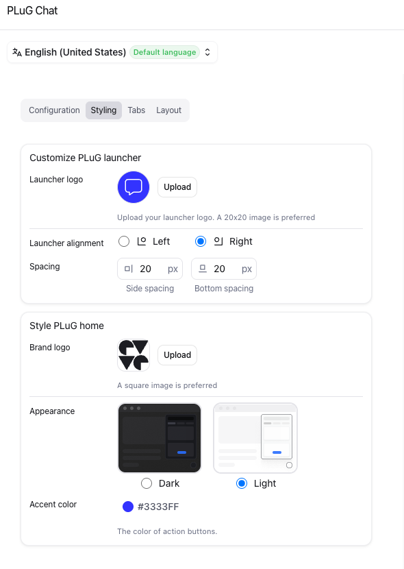
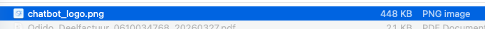
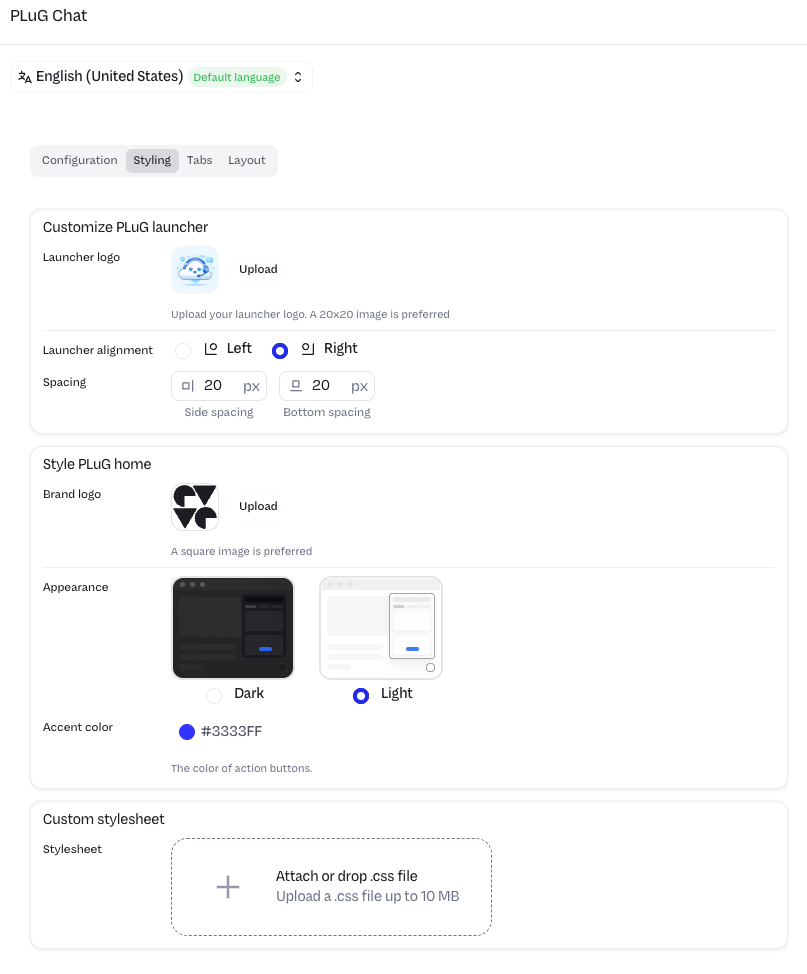
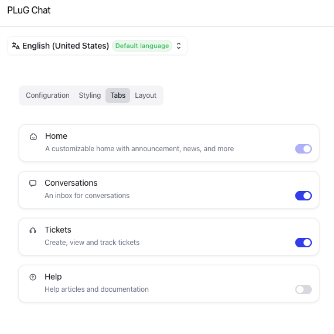
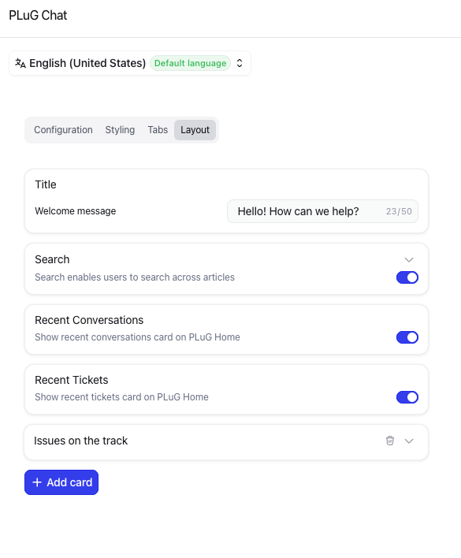

# Create and configure Computer for End-Users

## **Objective**  
Configure the Computer for End-Users (PLuG in the UI) for conversations between End users and DevRev.

## **What you will build**

* Enable Computer for End-Users (CfE)
* Configure CfE

## **Exercise steps**

➔ Navigate to **PLug Chat** in the Settings navigation pane. It will be in the *PLuG & Portal* section

  *Image 14. Location of the PLuG text.*  

➔ Click the **+ PLuG widget** button in the middle of the right pane.

  *Image 15. Enable the PluG chat.*  

➔ Now that the PLuG Chat has been enabled, we can change how the plugin will present it self on the customer's side. Default the **Configuration** tab will be selected as shown in below screenshot.

  *Image 16. Configuration of the CfE.*  

The most important parts are:

1. **You unique app ID:** This is something we will need to use in a later module. It's used for identifying the APP for the CfE, that way it knows what backend to use.

    !!! Abstract "More information"
        At the top of the screen you see the default language of the plugin. This can be changed id needed, but will follow the UI language by default. One important item to remember is that the plugin itself will answer in the language the user is using for thier conversations. Not just English! The default language is more for the items that are shown to the end users. Like buttons that are not configurable with respect to language. Example is the "Search for articles" you see in the screenhost above on the right side.
        
        As DevRev is by default a multitenant organisation cloud solution, this ID is to make sure the plugin will be talking to the correct tenant. The plugin can be implemented by using 7 lines of code (javascript). More detailed information can be found <A HREF="https://developer.devrev.ai/sdks/web/installation" target="_blank">here</a>.

2. **PLuG visibility:** You may want to restrict where the plugin is visible. Maybe just only when a user has logged in.
3. **Start new conversation:** What should the text of the button to start the conversation be (the blue/purple button in the screenshot above with the text "Send us a message").

    !!! Tip
        If you want to test any changes that are made and how they look like when deployed for the CfE, on the right hand side is an example of the settings. This also includes the other tabes that are going to be discussed.

➔ Click the tab **Styiling** and will be presented with other options with respect to the styling of the plugin.

  *Image 16. Styling of the CfE.*  

➔ Here you can:

1. What icon should the plugin be? (we will change that in a few)
2. Where should the plugin show itself? (default is right side in the bottom of the screen)
3. What should the logo be when the plugin shows itself?
4. What is the theme color, dark or light and the highlight color for buttons etc.

➔ In this screen we want to change the icon for the plugin. Download [this image](../chatbot_logo.png). Use right click mouse and select **Save Link As...**. Remember where you saved it as we need in the next step.

➔ Click the **Upload** button and use the earlier downloaded image. 

  *Image 17. THe downloaded image as Icon for the plugin.* 

➔ After you clicked *Open* you should see the below screenshot

  *Image 18. The new icon of the CfE.*  

➔ At the bottom of the Styling tab, you can also add a custom CSS file for the color and other settings like buttons, cards, lists, etc. More information can be found <A HREF="https://support.devrev.ai/en-US/devrev/article/H86AvWQa-plug-widget-customization#option-b-download-the-template-and-edit-manually" target="_blank">here</a>

➔ On the tab **Tabs** you see the tabs that are shown on the plugin when it opens. You can toggle some of the items and see the result in the Preview Pane on the far right. Bring all back to the default setting (all on).

  *Image 19. The Tabs tab of the CfE.*

➔ The last tab **Layout** you can change the options that are shown using toggle switches. Also try a few and see the result in the Preview Pane. Bring all back to the default setting (all on).

  *Image 20. The Layout tab of the CfE.*

➔ Click the **Save and publish** button in the far top corner of the screen to activate the new icon, and any other settings you may have changed, for the plugin. A screen may appear, where you click **Got it**.

Now that we have the plugin configured we are going to use it. Instead of taking over the website, we are going to use an Overlay tool that mimics like if we have the plugin intergrated in the website as discussed eaerlier in one of the notes (under more information).

<B>This concludes this module of the workshop</B>

