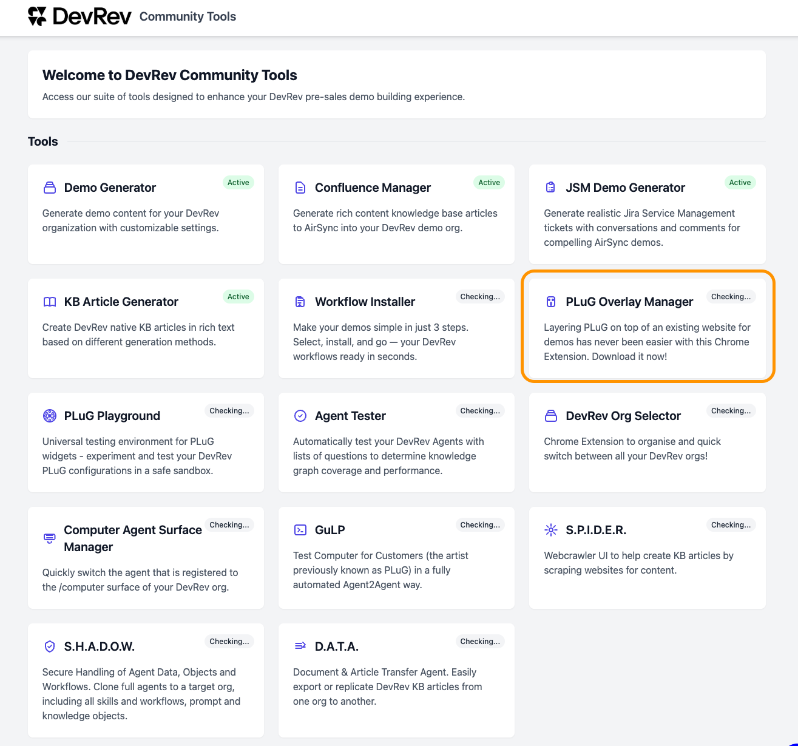
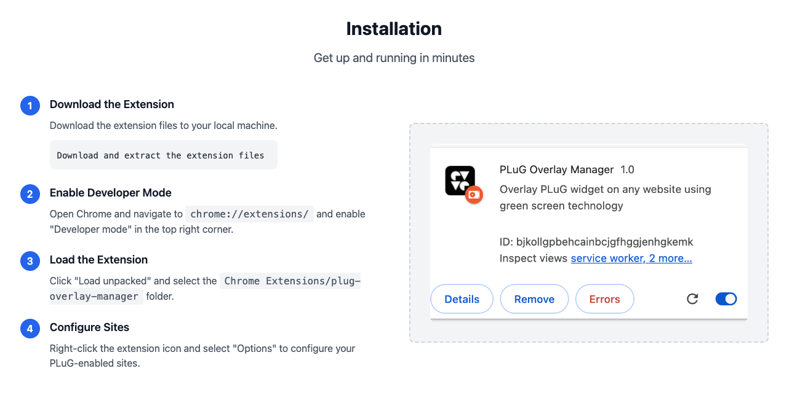

# Chrome Extension - Installation

**Objective**  
As we cannot always take over a customers website in PoCs or demo's, a tool has been created. The PluG Overlay Manager. This tool uses Javascript injection to mimic an implemented CfE.

**What you will build**

* Install the Chrome Extension

!!! Danger "Be Aware"
    For now there is no other browser extension available. This is a tool that has been created by the SE community of DevRev. If there is a newer version, or for an other browser, please visit the page again to see if there is an update. 
  
    Also as the extension is not in the extension store, updates have to be installed manually and will not be updated automatically

**Exercise steps**

➔ Open a new browser tab and navigate to [https://devrev.community](https://devrev.community). Here you will see a lot of tools that can be used by you to help you prepare for a demo. The tool we are going to focus on is called **PLuG Overlay Manager**

➔ Click **PLuG Overlay Manager**

{ width=50% }

  *Image 21. The tools at devrev.community.*

➔ Scroll down and goto the *Installation* section.

{ width=50% }

  *Image 21. The installation section of the PLuG Overlay Manager.*

➔ Follow the steps as described in this section. The end result should be that there is a new icon shown in the Chrome (Chromium like) browser.

  *Image 22. The new extension in the browser.*

Now that we have the extension installed, we need to configure it. This will be done in the next module.

<B>This concludes this module of the workshop</B>

