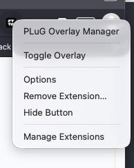
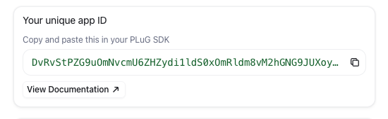
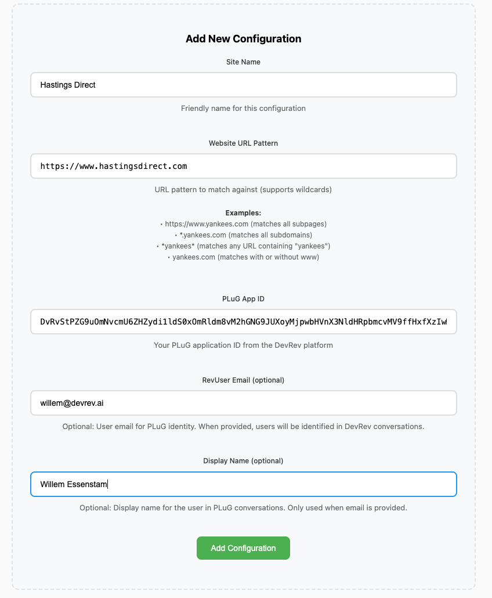
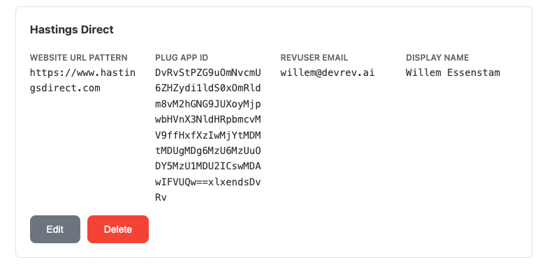

# Chrome Extensio - Configuration

**Objective**

Configure the Chrome Extension for the website of HastingsDirect.com.

**What You Will Build**

* Configure the Extension so it can be showed on hastingsdirect.com website

* Test the PLuG Overlay Manager

**Exercise steps**

## Configure the Extension

➔ Right click the newly added extension in the browser and select **Options**.

  *Image 24. The options selection of the extension.*

➔ In the screen that appears, use the following information:

1. **Site Name:** Hastings Direct
2. **Website URL Pattern:** https://www.hastingsdirect.com
3. **PLuG App ID:** You have to copy that from the PLuG Chat settings screen

    

    *Image 25. The PLuG Chat App ID.*

4. **RevUser Email (optional):** This would normaly be a user that the system knows as a contact. As that is outside of our scope, you can use whatever you want.
5. **Display Name:** This would normaly be a user that the system knows as a contact. As that is outside of our scope, you can use whatever you want.

{ width=50% }

  *Image 26. The options for the extension.*

➔ Click **Add Configuration** and the configuration will be shown at the bottom of the screen that appears.

{ width=50% }

  *Image 27. The saved confguration for the extension.*

<B>This concludes this module of the workshop</B>

