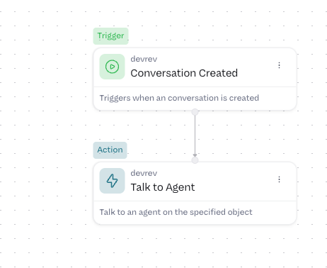
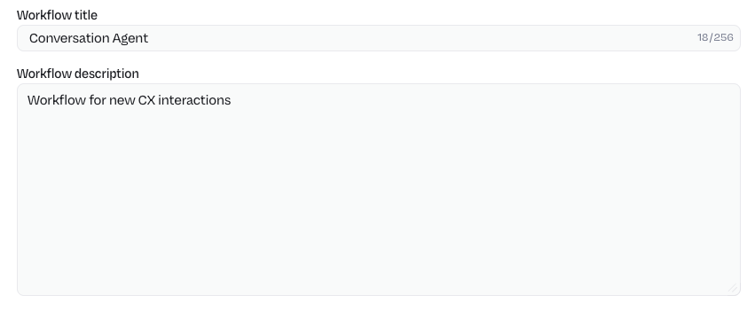
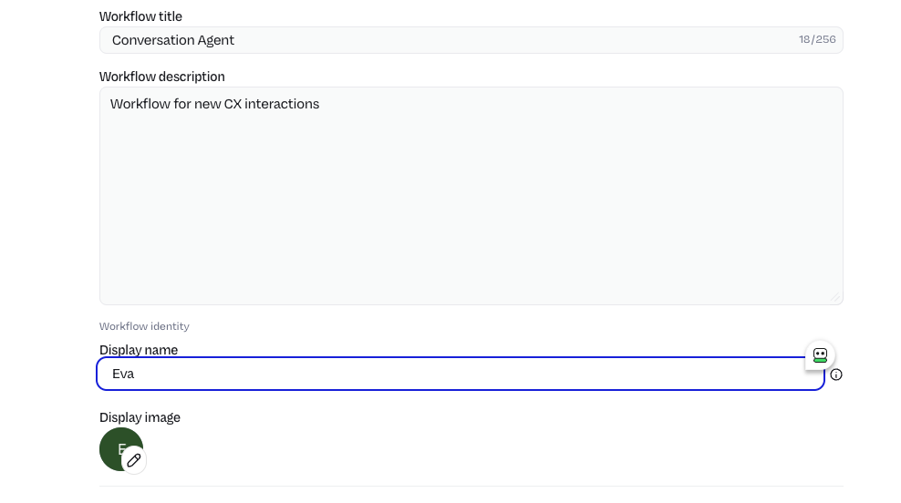

# Create Workflow for End-Users

Now that we have the minimum requirements (Agent and PLuG Overlay Manager) ready, we need to connect them to eachother when a conversation starts.

## **Objective**

Configure the Chrome Extension for the website of HastingsDirect.com.

## **What You Will Build**

* Configure the Extension so it can be showed on hastingsdirect.com website

* Test the PLuG Overlay Manager

## **Exercise steps**

### Create a workflow

➔ Navigate to **Workflows**

  *Image 28. Location of the Workflows text.*  

➔ Click the **+ Workflow** button to create a new workflow

➔ From the screen that pops-up, select **New workflow Start from scratch**

{% width=50% %}

  *Image 29. Start a new workflow from scratch.*  

➔ Click the **Add the first step...** node 

  *Image 30. Blank Workflow canvas.*  

➔ Search for **Conversation** and select **Conversation Started**

  *Image 31. Conversation started trigger node.*  

➔ Minimize the right pane by clicking the double chevrons pointing to the right (:material-chevron-double-right:)

➔ Click on the **+** sign at the bottom of the just added node 

➔ Select **Action**

  *Image 32. Add an Action node.* 

➔ Search for **Talk to Agent** and select the node

  *Image 33. Talk to Agent node.*  

➔ In the pane that opens on the right hand side, in the Agent section, click the **Add Agent** text and select from the dropdown box the Conversation Agent you just created earlier.

  *Image 34. Select correct Agent.* 

➔ In the **Object** field, click *Insert variable*. On the far right appearing pane, click **Conversation Created > Output** and select **Id**

  *Image 35. Add Object item.* 

➔ Click the **Visibility** field and set this to **external**

  *Image 36. Visibility.* 

➔ Click the **Panel** field and set this to **customer_chat**

  *Image 37. The Panel location setting.* 

➔ Click the **Respond To User Types** field and set it to rev_user

  *Image 38. Respond to user setting.* 

➔ Your Canvas should now look like this

  *Image 38. Workflow canvas.* 

### Changes

Now that we have the workflow we need to give it a friendly name. **Untitled Workflow** is not useful as it doesn't tell us anything.

➔ Click in the top row to the left the **pencil (:octicons-pencil-16:)**, just left of the **Validate** button.

  *Image 39. Edit the workflow.* 

➔ In the side bar change:

1. **Workflow title:** Conversation Agent
2. **Workflow description:** Workflow for new CX interactions

  *Image 40. Change workflow name and description.* 

➔ Click **Validate** in the top right corner. If all went correct it will change into **Deploy**. Click that button

➔ Now that we have the workflow created you can chnange two extra parameters. Click the Pencil again and see that there are now two other options: 

1. **Display name:** Change this into a name, like Eva
2. **Display image** Leave this for now, but be aware this is where you can provide a picture of the Agent.

➔ You can change these settings as you like. 

{% width=60% %}

  *Image 41. Extra changes to workflow.* 

!!! Example "In Production Environments"
    It would be a good idea to change the name and picture to be more destinct to mimic a human-being, or at least that the person in the conversation is talking to an AI solution and not just a chatbot.

Now that we have the backend ready we can focus on the front-end where our End-Users are.

    

<B>This concludes this module of the workshop</B>

