# Create Workflow for End-Users

Now that we have the minimum requirements (Agent and PLuG Overlay Manager) ready, we need to connect them to eachother when a conversation starts.

**Objective**

Configure the Chrome Extension for the website of HastingsDirect.com.

**What You Will Build**

* Configure the Extension so it can be showed on hastingsdirect.com website

* Test the PLuG Overlay Manager

**Exercise steps**

## Export an existing workflow

➔ Navigate to **Workflows**

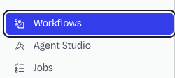

  *Image 28. Location of the Workflows text.*  

➔ There should be one workflow shown; *Agent Playground workflow*

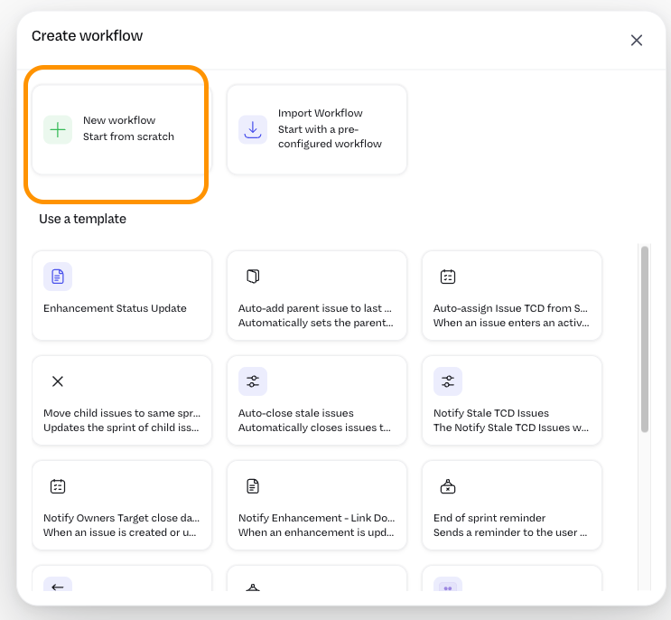{ width=70% }

  *Image 29. One workflow shown.*  

➔ Hoover the mouse over the workflow and click it. This will open the details of the workflow.

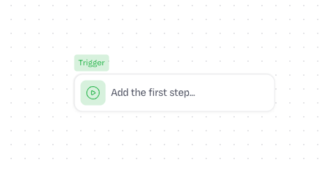{ width=80% }

  *Image 30. The details of the workflow are shown.*  

➔ Click the **Download** button (:octicons-download-16:) and save the file to a location you can remember as we need the downloaded JSON file in a few.

## Import an existing workflow as JSON

➔ Click the **+ Workflow** button in the top right corner.

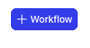

  *Image 31. Create workflow.*  

➔ In the next screen, click the tile **Import Workflow Start with a pre-...**

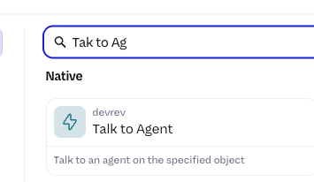

  *Image 32. Import workflow.*  

➔ In the next screen, select the earlier downloaded JSON file.

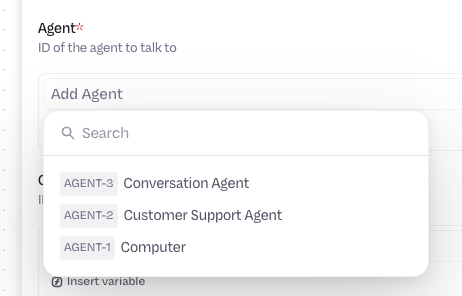

  *Image 33. Downloaded JSON workflow.*  

➔ After the JSON file is uploaded you will see the following Canvas:

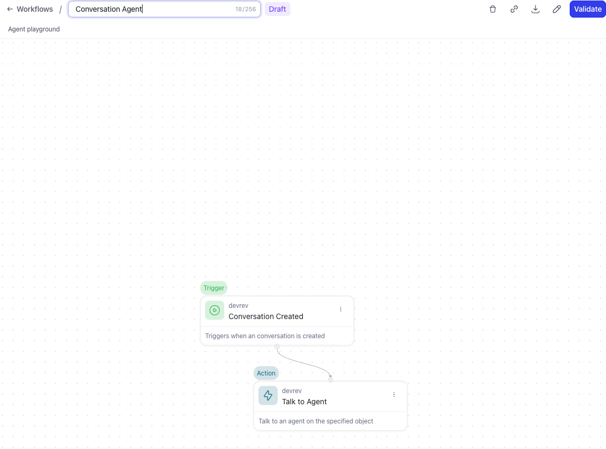{ width=50% }

  *Image 34. Uploaded workflow.*

## Reconfigure the workflow

➔ Click the name at the top of the screen and rename it to **Conversation Agent** and hit **Enter**.

➔ Click the **Conversation** trigger node.

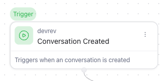

  *Image 35. Conversation trigger node workflow.*  

➔ In the screen that opens on the right hand side take these actions:

1. Click the **:material-delete-outline: Clear** button.
2. Click the **X** to the right of to the **When** text in the *Filter* section.

Both actions are shown in the below screenshot with their respective action numbers.

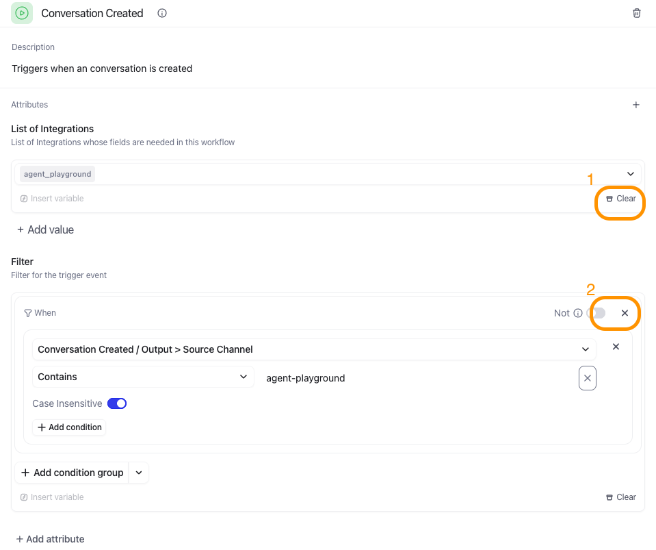{ width=50% }

  *Image 36. Actions on the Trigger node.*  

➔ Click the **Talk to Agent** node on the canvas.
 
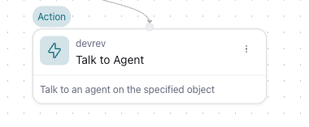

  *Image 37. Talk to Agent node in the workflow.*  

!!! note "Remark"
    If you don't see the canvas, use the two arrows pointing to the right to collapse the side pane.

    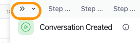

    *Image 38. Collapse side pane.*  

➔ In the side pane, click the **:material-delete-outline: Clean button** to remove the assigned Agent. We need to change it.

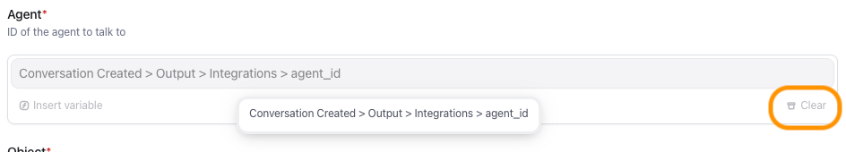

  *Image 39. Actions on the Talk to Agent node.*  

➔ Now click on the text **Add Agent**.

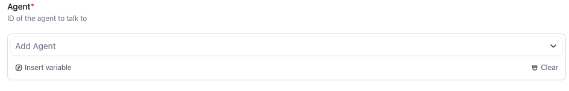

  *Image 40. Add Agent field in the Talk to Agent node.*  

➔ Select the **Agent number** that corresonds with the earlier created **Conversation Agent**.

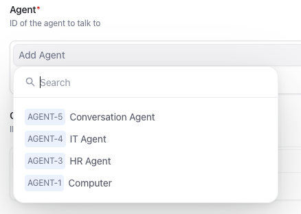

  *Image 41. Agent selection for the Talk to Agent node.*  

➔ Click the **Validate** button in the top right corner

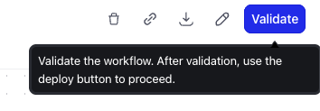

  *Image 42. Validate the workflow.*  

➔ If no issues rose that button will change into **Deploy** if it did, click it. If not, please rerun the steps to find the issue, or ask.

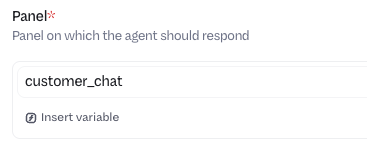

  *Image 43. Deploy the workflow.* 

➔ After deploy, use the breadcrumbs at the top to navigate back to Workflows. You should now see two workflows.

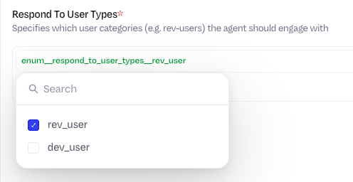

  *Image 44. Two Workflows shown.*  

## Optional changes

It is possible to change the avatar of the workflow when it gets triggered, as well as it description.

➔ Click in the top row to the left the **pencil (:octicons-pencil-16:)**, just left of the **+ Create new version** button.

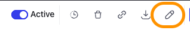

  *Image 45. Edit the workflow.* 

➔ In the side bar you can change:

1. Workflow title
2. Workflow description
3. Display name
4. The avatar by clicking the **Pencil** in the *Display Image* section

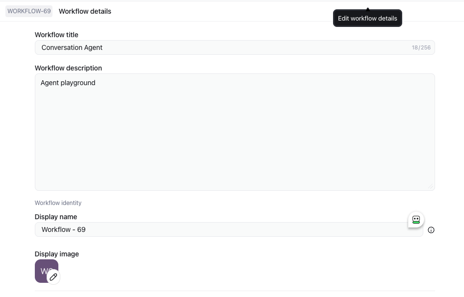

  *Image 46. Edit options for the workflow.* 

➔ You can change these settings as you like. It would be in production a good idea to change the name and picture to be more destinct to mimic a human-being, or at least that the person in the conversation is talking to an AI solution and not just a chatbot.

Now that we have the backend ready we can focus on the front-end where our End-Users are.

    

<B>This concludes this module of the workshop</B>

