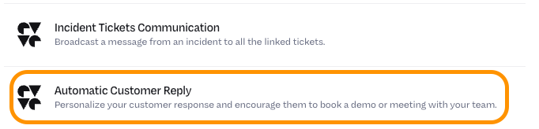
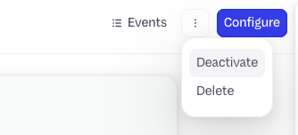
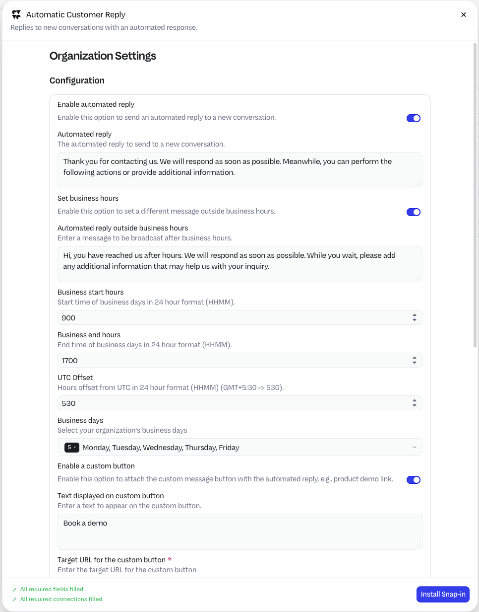
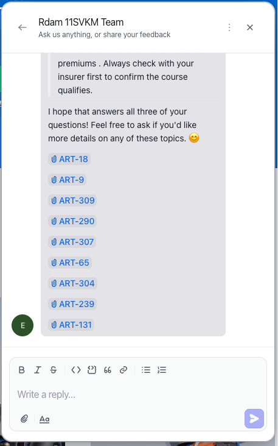

# Test using a conversation

## **Objective**  
Test the conversation possibilities by using the earlier configured steps in the modules.

## **What you will build**

* Test the environment

## **Exercise steps**

### Test the CX Agent

➔ In a new browser tab navigate to Hastings Direct page at https://www.hastingsdirect.com. If all has been configured correctly, the plugin should activate (green logo) and we see our uploaded image for the plugin.


  *Image 42. The plugin.*

➔ Click our uploaded image to open the plugin


  *Image 43. The full plugin.*

➔ Click the **Send us a message** button

➔ Ask the followiong question in the conversation that opened:"*What can you tell me about motorcycle insurances?*"


  *Image 44. The answer of the AI Agent.*

### Disable the Automatic Customer Reply snapin

There is an extra message stating something about *Thank you for contacting us...* this message is due to that we haven't setup any business hours in the system. Let's remove that message.

➔ Navigate back to your environment and navigate in the **Settings** menu to *Integrations > Snapins > Installed Snapins*

➔ Search for **Automatic Customer Reply** and click it.



  *Image 45. The Automatic Customer Reply.*

➔ The easiest way to disable the Snapin is to click the three dots and select **Deactivate**, then confirm the deactivation by clicking **Deactivate** again.



  *Image 46. The Deactivate selection.*

!!!Example "Other confgiuration options"
    We now deactivated the snapin, but there are lots of options that can be usefull. In your environment, click the **Configure** button in the top right corner and see what can be configured. Detailed informtion can be found <A HREF="https://support.devrev.ai/en-US/devrev/article/qW8nBHfZ-automatic-customer-reply" target="_blank">here</a>

    {% width=60% %}

    *Image 47. The Deactivate selection.*


### Continue the testing of the CX Agent

➔ As the first question was a straight forward question, let's see what would happen if we ask it a bit more reasoning to the answer... Ask the following question:

```
I don't drive much on my bike and I have heard/read about YouDrive. My questions are:
1. Is it available for Motorcycles?
2. What is the influence of: 55 years old male, 22 years drivers license with NO damage ever, less then 1300 MILES a year
3. Are there any accredited motorcycle trainings that lower the premium cost?

Answer my three questions seperately.
```

➔ It takes a bit longer, but the answer is retrieved using reasoning and given.


  *Image 48. The answer of the AI Agent.*

➔ As you can see at the bottom there have been multiple articles used to form the answers of our three questions!



  *Image 49. The answer of the AI Agent.*


<hr>

<font color="#FF6C0A" size="+2"><center><B>This concludes this module of the workshop</B></center></font>

<hr>