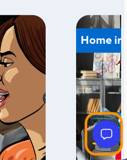
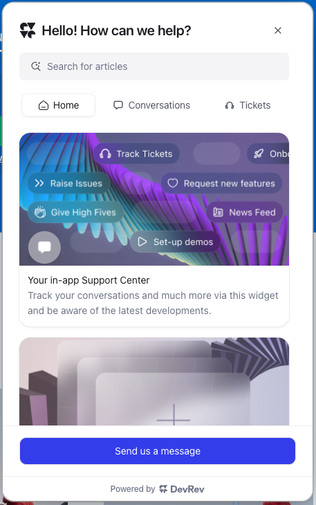
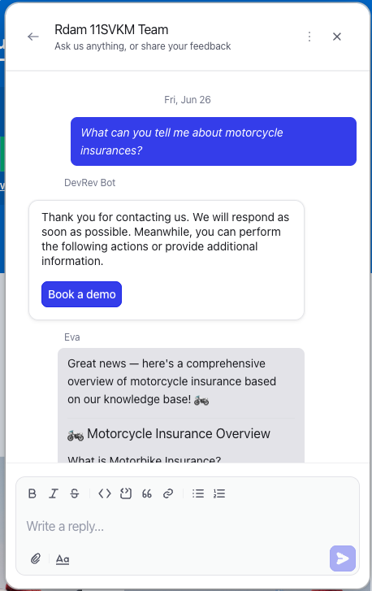
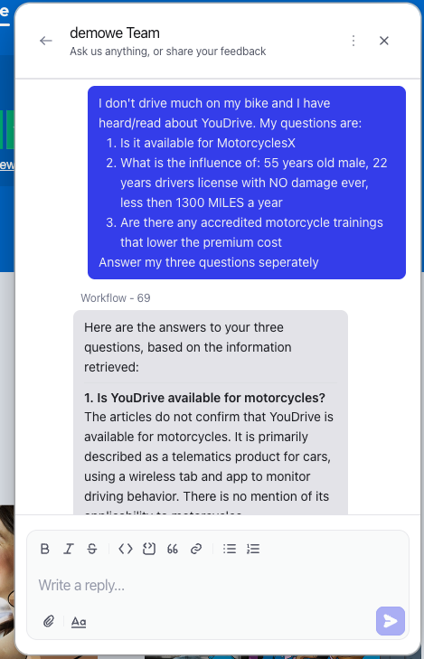

# Test using a conversation

**Objective**  
Test the conversation possibilities by using the earlier configured steps in the modules.

**What you will build**

* Test the environment

**Exercise steps**

➔ Navigate to the browser tab where the Hastings Direct page is open and the plugin is active (green logo) and we see our uploaded image for the plugin.



  *Image 47. The plugin.*

➔ Click our uploaded image to open the plugin



  *Image 47. The full plugin.*

➔ Click the **Send us a message** button

➔ Ask the followiong question in the conversation that opened:"*What can you tell me about motorcycle insurances?*"



  *Image 48. The answer of the AI Agent.*

➔ As this is an easy question, let's see what would happen if we ask it a bit more reasoning to the answer... Ask the following question:

```
I don't drive much on my bike and I have heard/read about YouDrive. My questions are:
1. Is it available for MotorcyclesX
2. What is the influence of: 55 years old male, 22 years drivers license with NO damage ever, less then 1300 MILES a year
3. Are there any accredited motorcycle trainings that lower the premium cost

Answer my three questions seperately.
```



  *Image 49. The answer of the AI Agent.*

It takes a bit longer, but the answer is retrieved using reasoning and given.

<hr>

<font color="#FF6C0A" size="+2"><center><B>This concludes this module of the workshop</B></center></font>

<hr>