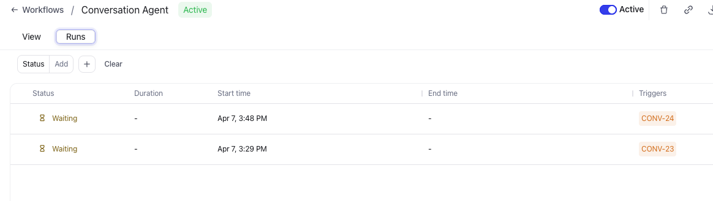
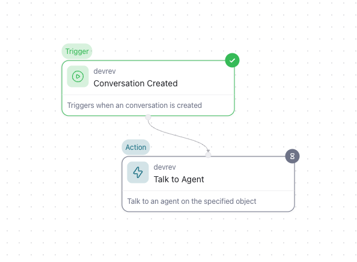
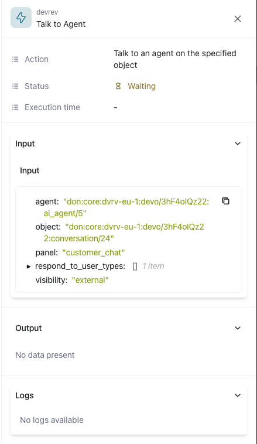

# See the log of the workflow

**Objective**  
Every run of a workflow might not always deliver the expected answer. How to find the reason, or where did the workflow got stuck or failed? This module is trying to give you a first troubleshooting step.

**What you will build**

* See logs that can help with troubleshooting

**Exercise steps**

➔ Revert back to the tab in the browser where the DevRev UI is.

➔ Select the **Workflows**, if you have left it.

➔ Click on the line with your created **Conversation Agent** and you will see two tabs at the top of the screen, *View* and *Runs*. The first we already know as we have created and reconfigured the Workflow. 

➔ Click the **Runs** tab.

➔ Here you can see the runs of the workflow you selected. Your workflow will have a *Waiting* as status as you have a conversation open. 

  *Image 50. The runs of the workflow.*

➔ Click the top one and see where the waiting state is shown.

  *Image 51. The details of the run of the workflow.*

➔ When clicking on the node, you can see what the input, output, and logs (if available) has been so far. 

  *Image 52. The details of the run node in the workflow.*

!!! tip
    If there is a failure in a workflow, this is the first step to see why and where, maybe even a reason, like the input values is wrong, or not what was expected.

<B>This concludes this module of the workshop</B>

